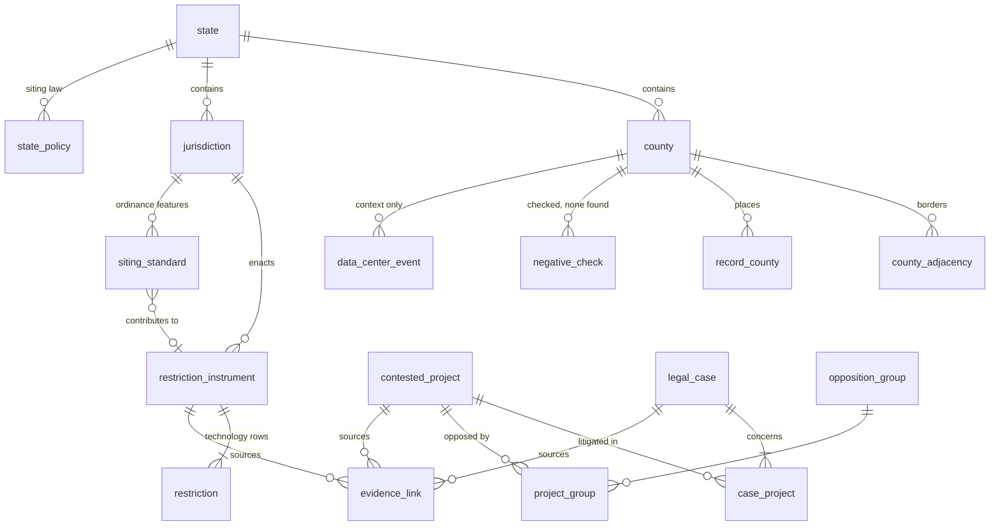

# National database and dashboard: design

**Status:** 2026-10-10. Phases 1 to 3 are built: the database (`db/`, `scripts/build_database.py`, `tests/test_build_database.py`), its publication by the Build dashboard data workflow, and the national, state and county views (`national-dashboard.html`, `tests/ui/national.spec.js`). Phases 4 and 5 are proposals.

This document designs one national database for everything the pipeline publishes, and one dashboard on top of it, to replace the four pages that read `data/processed/` today.

---

## 1. Where things stand

The pipeline already does the hard part. Seeds and review files go through `build_seed_outputs.py`, the QC gate and `classify.py`, and come out as CSV and JSON in `data/processed/`. `headline_metrics.json` holds the numbers to quote.

What it does not have is one place where the entities meet:

| Gap | Today |
|---|---|
| No joins across entities | A county's restrictions, projects, cases, NREL standards, data center events, neighbors and negative checks come together only in `site_profile.py`, a command-line tool. |
| Pages download everything | Each page fetches whole JSON files: `restrictions.json` is 8.2 MB and `siting_standards.json` is 14.1 MB. |
| Four overlapping pages | `index.html`, `dashboard.html`, `renewable-opposition-map.html` and `map-audit.html` each filter and count the same records their own way. |
| No query interface | A researcher who wants "severe solar restrictions in counties adjacent to a blocked project" has to write Python against the CSVs. |
| Coverage is a footnote | `headline_metrics.md` says 1,740 counties have never been examined, but no page shows which ones. |

## 2. Goals and non-goals

**Goals**

1. **One national database.** Every published entity in one queryable file, keyed by instrument and by county.
2. **One dashboard** that goes nation → state → county → record, plus a table explorer and downloads.
3. **The same numbers everywhere.** `headline_metrics.json` stays the authority. The database checks itself against it on every build and refuses to write if any number differs.
4. **Coverage and evidence on every view.** Every count shows its verified share beside it. The map tells apart a county with records, a county someone checked and found nothing in, and a county nobody has looked at.
5. **No server.** Static files on GitHub Pages, as now. No running cost, no credentials, nothing to keep up.

**Non-goals**

- Editing in the database. Review stays in `data/review/*.csv` and the promotion gates; the database is rebuilt from scratch every time.
- Scores or predictions. Like site profiles, the dashboard describes what is recorded.
- Folding data center events into renewable counts. They appear as county context only, as in profiles.
- Publishing local knowledge. `local_knowledge.csv` never enters the database.

## 3. Architecture

```
data/seed/*.csv, data/review/*.csv
        │  build_seed_outputs.py  (QC gate, classify, promotion; unchanged)
        ▼
data/processed/*.csv, *.json, headline_metrics.json      ← source of truth
        │  build_database.py  (db/schema.sql, load.sql, views.sql; parity check)
        ▼
data/db/renewable_opposition.duckdb   +   data/db/parquet/<table>.parquet, state_summary.json,
(built locally, never committed)           county_summary.json, state/<ST>.json
                                           (committed by the Build dashboard data workflow)
        │
        ├── national-dashboard.html: national, state, county views (summaries + state files)
        ├── explorer, phase 4 (DuckDB-WASM over the Parquet, loaded only there)
        └── downloads (DuckDB file, Parquet, the existing CSVs)
```

### Decision: DuckDB and Parquet, queried in the browser

| Option | For | Against |
|---|---|---|
| **DuckDB file + Parquet + DuckDB-WASM** (chosen) | One file researchers can open; Parquet is the standard open format; the whole database is **2.2 MB** as Parquet against 22 MB of JSON today; the browser runs real SQL, so the dashboard does not need a JSON file per view; no server. The session hook already installs the DuckDB CLI. | The WASM bundle is several megabytes, so it must load after first paint (see below). |
| Postgres / PostGIS (hosted) | Multi-user writes, a live API, spatial queries. | Needs a server, credentials, a sync job and a bill. The data has no live writers: everything goes through review CSVs and a build. Revisit only if that changes. |
| SQLite + sql.js | Small, universal, Datasette-compatible. | No Parquet; slower for the group-by work the dashboard does. A SQLite export is a few lines if someone needs one. |

**First paint.** The national view must not wait for the WASM engine. The build also writes two small JSON files, `data/db/state_summary.json` (52 rows, 3 KB) and `county_summary.json` (3,222 rows, 250 KB), from the views below, and the landing page draws from those plus `headline_metrics.json`.

**Revised 2026-10-10: DuckDB-WASM is for the explorer only.** Measured in phase 3, the engine is 35.7 MB (`duckdb-eh.wasm` 1.29.0), about 7 MB gzipped, before any Parquet. Loading that to open one county would cost a phone reader far more than the county's data. So the build writes one detail file per state, `data/db/state/<ST>.json`, from the same database with the same queries every build: the state's restrictions, projects, cases, siting standards (summarized per jurisdiction and technology), data center events, negative checks and county adjacency. The largest, New York, is 800 KB raw and 84 KB gzipped as GitHub Pages serves it. The state and county views read only that file. DuckDB-WASM waits for phase 4's explorer and SQL console, where arbitrary queries are the point, and loads only when someone opens them.

## 4. Data model

The schema is in `db/schema.sql`. Two keys run through everything:

- **`instrument_id`**, the counting unit: one ordinance, moratorium, project or case, however many technology rows it has. Every count in every view is a count of these.
- **`county_fips`**, the geographic spine: 2024 county FIPS, with `record_county` holding every county a record touches.



| Table | Grain | Rows now | Notes |
|---|---|---:|---|
| `state` | state, DC, PR | 52 | |
| `county` | 2024 county | 3,222 | `in_coverage_universe` excludes Puerto Rico, as `headline_metrics` does (3,144). |
| `county_adjacency` | county pair | 17,908 | from `geo.neighbors`, across state lines |
| `jurisdiction` | local government | 2,485 | matched on `common.jurisdiction_key`. A match key, not an authority file (phase 5). |
| `restriction_instrument` | instrument | 3,423 | technologies and types as arrays; severity is the highest of its rows; verification is the weakest |
| `restriction` | instrument × technology | 3,625 | the published rows, typed |
| `contested_project` | project | 576 | adds `outcome_class` (blocked, advanced, restricted, pending, needs_review) and `outcome_confirmed` |
| `legal_case` / `case_project` | case / case × project | 38 / 39 | one case can concern two projects |
| `siting_standard` | jurisdiction × technology × feature | 23,778 | NREL 2025, with `restriction_instrument_id` where a feature restricts |
| `state_policy` | state × policy | 0 | empty until state siting law is researched |
| `record_county` | record × county | 27,738 | from `county_fips_all`, with the placement method |
| `evidence_link` | record × role × URL | 6,669 | every URL behind a record, with its job (compiled source, primary source, ordinance, outcome evidence, placement, court record) and how it was seen (opened, archived, snippet) |
| `source_document` | source document | 52 | `sources.csv` as is |
| `opposition_group` / `project_group` | group / project × group | 802 / 30 | |
| `negative_check` | check | 1 | |
| `county_pending_review` | county | 3 | how many pending review-queue candidates name the county (`site_profile.pending_for`): the count only, never the candidates |
| `data_center_event` | event | 2,252 | from `data/reference/`, never counted |
| `build_info` | key/value | | build time, commit, the `headline_metrics.json` it was checked against |

### Views (`db/views.sql`)

- `v_headline_restrictions`, `v_headline_by_source`, `v_county_coverage_totals`: the headline numbers, recomputed. `build_database.py` compares them with `headline_metrics.json` field by field and stops on any difference.
- `v_county_summary`: one row per county with restriction, project, verification, moratorium and data center counts, and a **`coverage_status`**:
  - `has_records`: at least one published record placed in the county (1,403 now)
  - `checked_none`: a documented negative check and no record (1)
  - `not_examined`: neither; nothing is known either way (1,740)
- `v_state_summary`: the same per state, plus case and state-policy counts and the three coverage counts.
- `v_restrictions_by_month`: enactments by month, with an undated row per scope, because only 194 of 3,423 instruments carry an enactment date. All 2,393 NREL instruments are undated; NREL's `ordinance_year` (2001 to 2025, on 1,247 jurisdictions) can fill part of that in phase 5.

### Rules the database keeps

- It is derived; nothing in it is hand-edited. The `.duckdb` file is in `.gitignore`. The Parquet export and the two summaries are committed, and their bytes depend only on the data (rows sorted, build time and commit left out of `build_info.parquet`), so a build that changes no data commits nothing.
- It counts instruments, never rows, and keeps `multi_sector_data_centers` beside the renewables figure, never inside it.
- It publishes nothing the build holds back: no quarantine rows, no review candidates, no local knowledge. The one exception is a number: `county_pending_review` says how many candidates name a county, with nothing about them (decision 2 below).
- It aggregates deterministically (`min()`, never `any_value()`; every list ordered), so the published files are byte-identical across builds. The siting-standard summaries group by the jurisdiction's own name as well as its match key, because the key folds "Binghamton City" and "Binghamton Town" into one.

## 5. Dashboard design

### Principles

1. **Every count carries its evidence.** "1,362 severe restrictions · 69 verified against the instrument" on the same line, never the first number alone.
2. **Three-state coverage on every map.** Records shaded by the chosen metric; "checked, none found" as a light fill with an outline; "not examined" hatched. An unexamined county is never drawn as a zero.
3. **Every number opens its records**, and every record shows its sources with how each was seen ("verified", "source located, not yet read", "compiled report only").
4. **The URL is the state.** Every view, filter and selection lives in the hash, so any view can be linked and the site stays static.
5. **One codebase.** Plain JavaScript modules and no build step, as the repository does now; `basemap.js` and `counties_2024.topojson` are reused.

### Views

| Route | View | Contents |
|---|---|---|
| `#/` | **National** (built) | headline tiles from `headline_metrics.json`, counties examined among them; county map with a metric switch (severe restrictions, all restrictions, active moratoria, contested projects, blocked projects, coverage); sortable state table; records and verification by source. The enactment timeline waits for phase 5 (194 of 3,423 instruments are dated). |
| `#/state/IA` | **State** (built) | state framework (`state_policy`; "not yet researched" while empty); the state's county map; sortable county table; restrictions (multi-sector ones listed apart), projects and cases |
| `#/county/19113` | **County** (built) | coverage banner (records, checked with nothing found, or not examined); state framework; restrictions and projects in the county with their evidence and sources; the count of review candidates naming it, if any; NREL standards; adjacent counties with a map; data center activity (context, not counted) |
| `#/restriction/<id>`, `#/project/<id>`, `#/case/<id>` | **Record** | every field, technologies, placement method, and the full `evidence_link` list with access labels |
| `#/explore/<entity>` | **Explorer** | one table per entity with filters for state, technology, type, severity, status, scope, source, evidence level, verification and date; CSV export of the filtered rows |
| `#/coverage` | **Coverage and evidence** | counties not examined, by state; verification by source; the worklists' sizes. Absorbs `map-audit.html`. |
| `#/data` | **Data** | downloads (DuckDB, Parquet, CSV); a data dictionary generated from `db/schema.sql`; example queries; licenses and attribution (Sabin Center, NREL CC BY 4.0, Moratorium Nation CC BY 4.0, Data Center Tracker CC BY 4.0) |

### National view, wireframe

```
┌───────────────────────────────────────────────────────────────────────────┐
│ Renewable Opposition · National                       [State ▾] [Search]  │
├───────────────────────────────────────────────────────────────────────────┤
│ Restrictions      Severe            Contested projects   Cases             │
│ 3,340             1,362             576                  38                │
│ 69 verified;      severity 3 or 4   235 blocked,         38 with a court   │
│ +83 cover DCs     of 3,340          70 confirmed         record            │
├─────────────────────────────────────────────────┬─────────────────────────┤
│ Map: [Severe restrictions ▾]  [Solar][Wind][BESS]│ States                  │
│                                                  │ NY  537  271 severe     │
│        (county choropleth, 3 coverage states)    │ PA  474  164 severe     │
│                                                  │ MI  300   85 severe     │
│ ▒ not examined (1,740)  □ checked, none (1)      │ ...                     │
│ ■ records (1,403)                                │                         │
├─────────────────────────────────────────────────┴─────────────────────────┤
│ Instruments (verified) by source │ Enacted by month (194 dated, 3,229 undated)│
│ Sabin 2026   ███ 756 (1)         │ ▁▂▂▃▅▆█▇                                │
│ NREL         ████████ 2,393 (27) │                                         │
│ Moratorium N █ 210 (43)          │                                         │
└───────────────────────────────┴────────────────────────────────────────────┘
```

### County view, wireframe

Placeholders in angle brackets; the layout, not the data, is the point.

```
┌───────────────────────────────────────────────────────────────────────────┐
│ ← State   Example County, ST (00000)       coverage: has records          │
├───────────────────────────────────────────────────────────────────────────┤
│ State framework       state siting law not yet researched                 │
├───────────────────────────────────────────────────────────────────────────┤
│ In the county                                                             │
│  Restriction  <type>, <status>, severity <n>     verified | located | not │
│  Project      <name>, <technology>, <outcome>    read source | report only│
├──────────────────────────────────────┬────────────────────────────────────┤
│ Adjacent counties (mini map)         │ NREL siting standards              │
│  <Neighbor A> · 2 restrictions       │  <technology>: <feature> <value>   │
│  <Neighbor B> · not examined         │  NREL's reading, unverified        │
├──────────────────────────────────────┴────────────────────────────────────┤
│ Data center activity (context, not counted) · Groups active nearby        │
└───────────────────────────────────────────────────────────────────────────┘
```

### What happens to the current pages

Decided 2026-10-10: `index.html`, `dashboard.html` and `renewable-opposition-map.html` redirect to the new dashboard once it has the explorer and record views that replace what they do (phase 4), and passes the smoke tests. Until then the four pages stay as they are, and the new dashboard sits beside them at `national-dashboard.html`. `map-audit.html` stays as an internal page until the coverage view covers its checks.

### Map encoding

The county map shades by fixed classes (0, 1, 2–4, 5–9, 10 or more) so a shade means the same count on every view. The ramp is the teal of the existing county choropleth, re-stepped and checked with the dataviz palette validator against both page surfaces. "Not examined" is a neutral grey and "examined, none recorded" is near-white; with the first teal step, the three pass the all-pairs separation checks (colour-blind and normal vision) in light and dark, so an unexamined county never reads as a zero. Every value on a map is also in a table on the same view.

## 6. Phased plan

| Phase | Scope | Done when |
|---|---|---|
| **1. Database** (done) | `db/schema.sql`, `load.sql`, `views.sql`; `scripts/build_database.py`; parity with `headline_metrics.json`; tests | built, tested, parity holds |
| **2. Publish** (done) | the Build dashboard data workflow runs `build_database.py --publish`, which writes `data/db/parquet/` (25 files, about 2.1 MB) and `data/db/state_summary.json` (3 KB) and `county_summary.json` (250 KB); the workflow commits them so GitHub Pages serves them | Parquet and summaries on the published site after each build |
| **3. Dashboard shell** (done) | `national-dashboard.html`: national, state and county views from the summaries and `data/db/state/<ST>.json`; Playwright tests (`tests/ui/national.spec.js`: figures equal the published files, unexamined counties drawn as such, axe, phone width) and the frontend smoke test | totals match `headline_metrics.json` on every view |
| **4. Explorer and records** | explorer and SQL console on DuckDB-WASM, record pages, coverage view (worklist sizes only), data page, downloads; old pages redirect | the four old pages retired |
| **5. Depth** | Census GEOIDs for jurisdictions (places and county subdivisions) in place of the match key; NREL `ordinance_year` on the timeline; state siting law for all 50 states; build-to-build history from `data/snapshots/` so the dashboard can show what changed | |

## 7. Decisions for Price

1. ~~**Where the Parquet lives.**~~ Decided 2026-10-09: committed in `data/db/parquet/`, served by GitHub Pages. The `.duckdb` file can go on a release when there is one.
2. ~~**What the public dashboard shows.**~~ Decided 2026-10-10: published records only, with the count of pending review candidates that name the county and no detail (`county_pending_review`).
3. ~~**Worklists on the public site.**~~ Decided 2026-10-10: the coverage view (phase 4) shows the worklists' sizes; the worklists stay in the repository.
4. ~~**Retiring the old pages.**~~ Decided 2026-10-10: redirect them once the new dashboard passes the smoke tests (phase 4, see above).

## 8. Building the database

```bash
python scripts/build_database.py                              # data/db/renewable_opposition.duckdb
python scripts/build_database.py --publish                    # also data/db/parquet/, the two summaries and data/db/state/
duckdb -readonly data/db/renewable_opposition.duckdb \
  -c "SELECT state_code, restrictions, severe_restrictions, counties_not_examined FROM v_state_summary ORDER BY restrictions DESC LIMIT 10"
```

The build reads only files the pipeline already publishes (and `data/review/negative_checks.csv`, `data/reference/data_center_events.csv` and the county boundary file), takes about 15 seconds, and exits 1 without writing if any headline number differs from `headline_metrics.json`.
